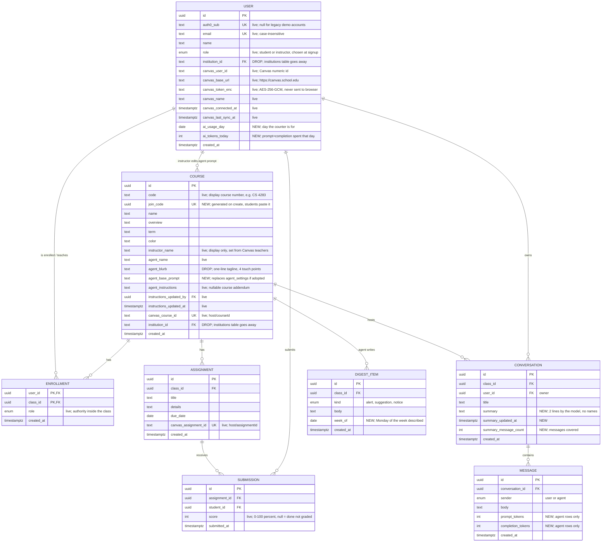

# ERD v3 — Course AI Helper

**Status: proposal, reconciled against the repo at commit `9564d65` (Connect Canvas via personal access token).**
The schema in the database today is `server/src/schema.js` + migrations `0000`–`0002`. This doc
is the target we would migrate toward; every field and table is tagged so nobody reads a plan as
a fact:

- **live** — exists in `schema.js` and is used by the API/UI today.
- **NEW** — proposed, nothing in the code yet.
- **DROP** — exists today; the doc proposes removing it, and lists what has to change first.

Table names stay as in the code: **COURSE** = `classes`, **CHAT** = `conversations`.

## 1. What the first draft claimed vs. what the repo does

| Draft claim | In the repo? | What actually depends on it |
| --- | --- | --- |
| `institutions` is gone | **Still live; decided: DROP.** | `users.institution_id`, `classes.institution_id`; email-domain → institution lookup in `auth.js`; `autoEnroll()` on signup; dashboard eyebrow shows `institution.name`; `/me` and `SessionContext` carry `institution`. Removal checklist in §2. The `.edu` check does not depend on it (`isAcademicDomain()` is a regex). |
| `sessions` is gone | **No, live.** | `POST /auth/login` (legacy/demo login) still issues session UUIDs; README says the demo accounts keep working on the live site. Can only go when the demo login goes. |
| `announcements` is gone | **Still live; decided: DROP.** | `/me` returns them; both dashboards render `<Announcements>`. Seed data only. Removal checklist in §2. |
| `agent_settings` is gone, prompt lives per class | **No, live.** | Single-row table; `GET/PATCH /agent-settings`; `getAgentSettings()`; `AgentPromptTile.jsx` has two boxes (global base + per-class instructions). Moving the base prompt onto `classes` is a refactor of 3 server files + the tile, not a rename. |
| Audit columns `agent_updated_by/_at` | **Named differently.** | Live names are `instructions_updated_by` / `instructions_updated_at` (migration `0001`). Keep the live names unless the base prompt moves per class. |
| Join code per class | **No.** | Students join by typing the course number (`POST /classes` with role=student matches `lower(code)` and creates a placeholder class if unknown). No `join_code` column. |
| AI usage per user per day | **No.** | No usage columns, no `DAILY_TOKEN_LIMIT`, and `llm.js` does not read `usage` from the vLLM stream (needs `stream_options: {include_usage: true}`). The draft's separate `ai_usage` table is replaced below by two columns on `users`. |
| `agent_blurb` dropped | **No, live.** | Set on create and on Canvas sync; rendered in `StudentClassView.jsx`; used in `buildSystemPrompt()` and the stub reply. Cheap to drop, but it is 4 touch points, not 0. |
| Conversation summaries + token counts | **No.** | `conversations` has no summary columns; `messages` has no token columns. Summaries need a second model call per reply. |
| `digest_items.week_of` | **No.** | Digest rows are seed data only; nothing generates them yet. |
| Canvas fields | **Missing from the draft; live in the repo.** | `users.canvas_*` (6 cols), `classes.canvas_course_id` (unique), `assignments.canvas_assignment_id` (unique), `classes.instructor_name`. See §4. |

Everything else in the draft (enrollments, assignments, submissions, messages, conversations
shape, cascades, most indexes) matches the live schema.

### Decisions needed before this becomes "final"

Decided: **`institutions` and `announcements` are dropped** (pivot away from the institution model;
no announcements feature). Still open:

1. **Keep or drop `sessions`?** Must stay while the demo login exists. Drop in the same commit that removes `POST /auth/login`.
2. **Per-class base prompt vs. global `agent_settings`?** Product call. The global row is what the UI edits today; per-class is the draft's proposal. Either is fine; do not do both.
3. **Which of the four new features (join code, usage limit, summaries, digest generation) are in scope for the hackathon?** Rough cost: join code ½ day, usage limit ½ day, digest generation 1 day, summaries 1 day.

## 2. Target ERD



Not drawn: `sessions` (`token uuid PK`, `user_id FK`, `created_at`) — live, legacy demo login
only, drop together with `POST /auth/login`. `agent_settings` (`id=1`, `base_prompt`,
`updated_by`, `updated_at`) — live; goes away only if decision 2 picks per-class base prompts.

### Removal checklist: `institutions` + `announcements` (decided, not yet done)

One migration: drop `announcements`, drop `users.institution_id` and `classes.institution_id`
(and their FKs), drop `institutions`, drop the `announcement_source` enum. Code that has to
change in the same commit:

| File | Change |
| --- | --- |
| `server/src/schema.js` | remove `institutions`, `announcements`, `announcementSource`, both `institutionId` columns |
| `server/src/auth.js` | remove `institutionForDomain()`; `checkEmailDomain()` keeps only the `REQUIRE_ACADEMIC_EMAIL` regex check; `autoEnroll()` loses the institution filter (or is removed — join code / Canvas sync replace it); `publicUser()` drops `institutionId`; `/auth/register` and `/auth/login` responses drop `institution` |
| `server/src/routes/me.js` | drop the `institution` lookup and the `announcements` query; response loses both keys |
| `server/src/routes/classes.js`, `server/src/routes/canvas.js` | stop writing `institutionId` on class insert |
| `server/src/seed.js` | drop the two tables from the truncate list and the seed inserts |
| `src/state/SessionContext.jsx` | stop storing `institution` |
| `src/pages/student/StudentDashboard.jsx`, `src/pages/instructor/InstructorDashboard.jsx` | remove `<Announcements>`; eyebrow becomes a constant |
| `src/components/Announcements.jsx` | delete |
| `src/pages/InstitutionAuth.jsx`, `src/App.jsx` (`/auth` route) | legacy institution picker — delete when the demo login goes; until then it can stay, it only reads `src/data/mock.js` |
| `src/components/CanvasConnect.jsx`, `src/data/mock.js` | the Canvas URL suggestion reads the static list in `mock.js`, not the DB; keep as a plain `{ domain → canvasUrl }` map keyed by the user's email domain, or drop the suggestion |

## 3. Indexes and constraints

| Table | Constraint | Status | Why |
| --- | --- | --- | --- |
| `users` | unique `lower(email)`, unique `auth0_sub` | live | one account per person; Auth0 lookup is one indexed read |
| `enrollments` | PK `(user_id, class_id)`, index `class_id` | live | roster and "my classes" queries |
| `classes` | index `lower(code)` | live | student join-by-course-number (goes away if join codes replace it) |
| `classes` | unique `canvas_course_id` | live | Canvas sync upserts on it; two users importing the same course share one row |
| `classes` | unique `join_code` | NEW | joining is unambiguous across semesters and schools |
| `assignments` | index `(class_id, due_date)` | live | upcoming-work lists |
| `assignments` | unique `canvas_assignment_id` | live | Canvas sync upserts on it |
| `submissions` | unique `(assignment_id, student_id)`, index `student_id` | live | one row per student per assignment; averages are computed from here |
| `conversations` | index `(user_id, class_id)` | live | chat list |
| `conversations` | index `(class_id, summary_updated_at)` | NEW | "this week's questions" for the instructor digest |
| `messages` | index `(conversation_id, created_at)` | live | history in order |
| `digest_items` | index `class_id` | live | class view |
| `digest_items` | index `(class_id, week_of)` | NEW | one week's digest per class; regenerate = delete + insert that week |
| `users` | `ai_usage_day`, `ai_tokens_today` | NEW | no index; the limit check reads the `req.user` row already loaded by `requireUser` |

Cascades (live): deleting a user removes their enrollments, conversations, messages, submissions
(the daily budget lives on the user row itself); deleting a class removes its enrollments, assignments,
conversations, digest. `instructions_updated_by` is `on delete set null`.

## 4. Field notes

**USER**
- `auth0_sub` — Auth0's stable user id. `POST /auth/register` fills it on first Auth0 login; a
  legacy account with the same email gets linked instead of duplicated. Nullable because seeded
  demo accounts have none.
- `role` — chosen on the landing page. Decides whether "Add class" means *create* (instructor)
  or *join* (student). Permissions *inside* a class come from `enrollments.role`.
- `canvas_*` — personal-access-token link (`POST /canvas/connect`). `canvas_base_url` is
  per-user because every school runs its own Canvas host. The token is encrypted with
  `CANVAS_TOKEN_KEY` and bound to the user id as AAD, so a row copied to another user cannot be
  decrypted. `canvas_last_sync_at` is null until the first sync finishes.

**ENROLLMENT**
- `role` — a TA can be instructor in one class and student in another. Every in-class check
  (`requireMember`) reads this column. Canvas sync writes it from the enrollment type
  (teacher/TA → instructor) and overwrites on every sync.

**COURSE (`classes`)**
- `code` vs `join_code` — `code` is the human name ("CS 4283"), not unique across semesters or
  schools. Today students join by `code`; the proposal is a generated `join_code` UUID that the
  instructor shares. Canvas-imported classes still get one (the instructor may want to add a
  student who is not in Canvas), but their normal join path is the Canvas sync.
- `canvas_course_id` — `"<canvas host>/<course id>"`. The host prefix keeps two schools'
  course #1234 apart. Unique, so the first person to sync creates the row and everyone else
  joins it. Only a teacher/TA sync may rename the class (students' syncs see their private
  nickname as `name`).
- `instructor_name` — display only; Canvas fills it from the course's `teachers`.
- `agent_name` — what the assistant calls itself. `agent_blurb` is the one-line tagline shown
  under it; the proposal drops it (remove from `classes.js` create, `canvas.js` sync,
  `agent.js` prompt + stub, `StudentClassView.jsx`).
- `agent_base_prompt` (NEW, if adopted) — replaces the global `agent_settings.base_prompt` so
  each class is self-contained. Seeded from `DEFAULT_BASE_PROMPT` in `agent.js` on create.
- `agent_instructions` — course-specific addendum, appended to (never substituting) the base
  prompt. See `buildSystemPrompt()`.

**ASSIGNMENT / SUBMISSION**
- `submissions.score` — percent. `null` means marked done / submitted but not graded. Canvas
  sync computes it as `round(score / points_possible * 100)` and only writes a row for real
  work (not auto-zeroed missing, not excused).
- Class average and per-assignment average are `avg(score)` over non-null rows.

**CONVERSATION** (NEW columns)
- `summary` — two lines written by the model after each reply, no names. The instructor
  digest reads this instead of raw transcripts.
- `summary_updated_at` — drives "questions from the last 7 days".
- `summary_message_count` — how many messages the summary covers, so a job can tell it is stale
  without diffing.

**MESSAGE** (NEW columns)
- `prompt_tokens / completion_tokens` — what vLLM reports (agent rows only). Requires sending
  `stream_options: { include_usage: true }` and reading the final chunk's `usage` in
  `llm.js#streamChat`. Also what `ai_tokens_today` is incremented from.

**DIGEST_ITEM**
- `kind` — `alert` (many students stuck on the same thing), `suggestion` (a concrete teaching
  action), `notice` (FYI). The UI colors by kind.
- `week_of` (NEW) — Monday of the week described. Regenerating a week deletes and reinserts
  that week's rows, so pressing the button twice never duplicates.

**USER — daily AI budget** (NEW columns `ai_usage_day`, `ai_tokens_today`)
- Two columns on `users`, not a table. The "reset every day" is implicit: on every model call
  the user triggers (class chat and helper bubble), one statement does both the rollover and
  the add —

  ```sql
  update users
     set ai_tokens_today = case when ai_usage_day = current_date then ai_tokens_today else 0 end + $used,
         ai_usage_day    = current_date
   where id = $user_id
  ```

  `$used` is `usage.prompt_tokens + usage.completion_tokens` from the vLLM response. No cron,
  no rows to prune.
- The check before each reply is `ai_usage_day = current_date and ai_tokens_today >= DAILY_TOKEN_LIMIT`
  on the `req.user` row that `requireUser` already loaded — zero extra queries.
- Limit is one number (`DAILY_TOKEN_LIMIT` in the API env). Per user, not per class, on
  purpose: the budget protects the GPU per person. Summaries and digests are system cost, not
  counted.
- A per-day history table (`ai_usage(user_id, day, tokens)`) is only needed if we want a usage
  chart or cost-per-week; add it then, not now. `messages.prompt_tokens/completion_tokens` can
  rebuild it from the transcripts anyway.

## 5. Possible upgrade fields — deeper Canvas integration

What is live: a personal access token per user, verified against `/api/v1/users/self`,
importing that user's active courses, published dated assignments, and *their own* submissions.
The tiers below are ordered by value ÷ effort. Each lists the Canvas endpoint, the columns,
and the feature it unlocks. None of these are built.

### Tier 1 — small columns, big payoff (½ day each)

| Table | New column(s) | From Canvas | Unlocks |
| --- | --- | --- | --- |
| `assignments` | `points_possible numeric`, `due_at timestamptz`, `html_url text` | `/courses/:id/assignments` (already fetched; these fields are dropped today) | "Open in Canvas" link; exact deadline instead of a date; raw points on the Performance tile |
| `submissions` | `raw_score numeric`, `workflow_state text`, `late bool`, `missing bool`, `graded_at timestamptz` | `include[]=submission` on the same call (already fetched) | Digest can say "4 students late on HW3" instead of only averages; UI can show submitted / graded / missing |
| `classes` | `canvas_time_zone text`, `canvas_term_id text`, `canvas_synced_at timestamptz` | `/courses?include[]=term` (already fetched; `time_zone` is used for the due-date conversion but not stored) | Correct "due today" for the helper bubble across time zones; show which classes are stale |

### Tier 2 — the instructor's token sees the whole class (1 day)

Today a teacher's sync only records the teacher's own (empty) submissions. A teacher/TA token
can read everyone's, which makes the Performance tile and the digest real:

| Table | New column(s) | From Canvas | Unlocks |
| --- | --- | --- | --- |
| `users` | *(none — reuse `canvas_user_id`, `email`)* | `/courses/:id/enrollments?type[]=StudentEnrollment&include[]=email` | Placeholder `users` rows for students who have not signed in yet (`auth0_sub` null). `POST /auth/register` already links a new Auth0 login to an existing row by email, so the placeholder becomes their account on first login. |
| `enrollments` | `canvas_enrollment_id text`, `canvas_section_id text`, `current_score numeric`, `last_activity_at timestamptz` | same call with `include[]=total_scores` | Class average with zero per-assignment sync; "5 students inactive for 2 weeks" for the digest; sections for large lectures |
| `submissions` | *(Tier 1 columns)* | `/courses/:id/students/submissions?student_ids[]=all&include[]=assignment` | Per-assignment averages over the whole roster, not just users of this app |

Needs: a `syncUser()` branch when the enrollment role is instructor, and a rule that a
student's sync never overwrites rows a teacher sync wrote (mirror the existing "students
don't rename the class" rule).

### Tier 3 — course content in the agent's prompt (1–2 days)

| Table | New column(s) / table | From Canvas | Unlocks |
| --- | --- | --- | --- |
| `classes` | `syllabus_text text` (HTML stripped, capped ~4 KB) | `/courses/:id?include[]=syllabus_body` | The assistant knows the grading policy, office hours, late policy — the questions students actually ask |
| new `course_modules` | `id`, `class_id FK`, `canvas_module_id UK`, `name`, `position int`, `unlock_at` | `/courses/:id/modules` | "Which week are we on" — the agent can point to *this week's* reading; digest can align to the module, not the calendar |
| new `course_materials` | `id`, `module_id FK`, `canvas_item_id UK`, `kind` (page/file/link), `title`, `html_url`, `body_text` (pages only) | `/courses/:id/modules/:id/items`, `/courses/:id/pages/:url` | The "point to the relevant reading" rule in the base prompt becomes a real link. `body_text` is the seed for retrieval later; skip it if there is no time. |

Prompt-injection note: Canvas text goes straight into the system prompt. Keep using
`canvas.clean()` / `stripHtml()` with caps, and put Canvas content under a clearly labeled
"course materials (untrusted)" heading in `buildSystemPrompt()`.

### Tier 4 — plumbing, only if the above lands

| Table | New column(s) / table | Why |
| --- | --- | --- |
| `users` | `canvas_refresh_token_enc text`, `canvas_token_expires_at timestamptz`, `canvas_scopes text[]` | OAuth2 developer-key flow instead of pasted tokens (README already names this as the planned replacement). `verify`/`sync` in `canvas.js` do not change. |
| `users` | `canvas_sync_error text`, `canvas_auto_sync bool default false` | Show the last failure on the Connect Canvas card; opt-in nightly sync instead of the manual button |
| new `canvas_sync_runs` | `id`, `user_id FK`, `started_at`, `finished_at`, `courses int`, `assignments int`, `submissions int`, `error text` | Debugging syncs on the live site without reading server logs; replaces the in-memory `lastRun` cooldown map with something that survives a restart |

### Not worth it for the hackathon

- **Writing back to Canvas** (grades, comments) — needs teacher scopes most schools will not grant a developer key, and the app has no grading UI.
- **Canvas LTI launch** — the right long-term integration, but a separate app registration and a different auth model; do not start it during the event.
- **Files / attachments** — storage, virus scanning, and copyright; out of scope.
