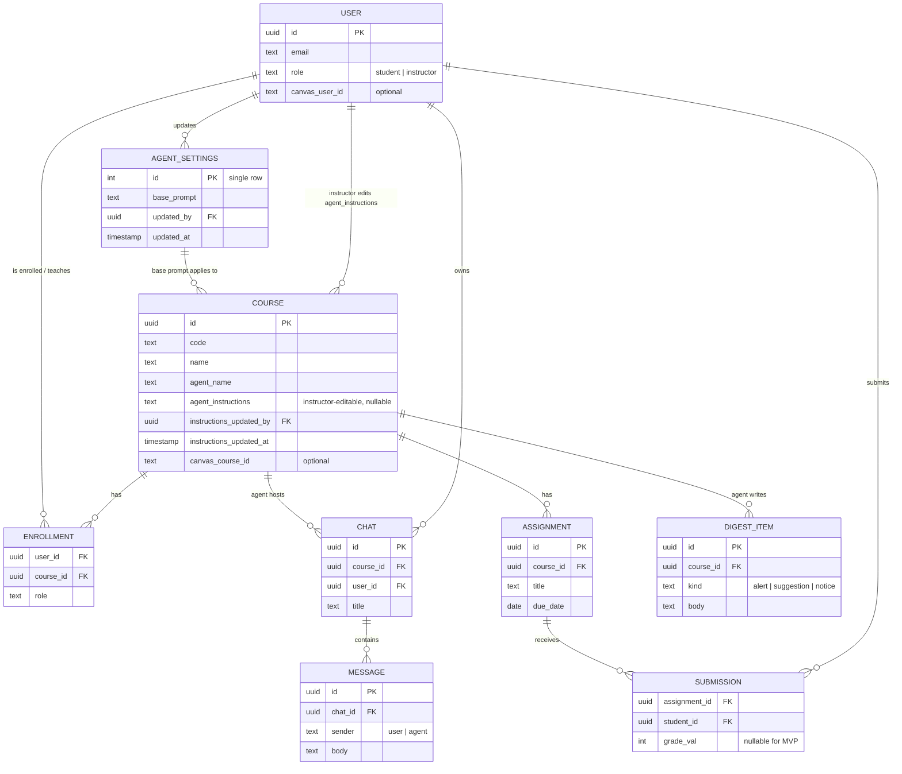

# Entity-Relationship Diagram — Course AI Helper

v2: one AI agent, with a global base prompt and instructor-editable per-course instructions.

Table names in the database differ from the ERD labels in two places, kept for
code stability: **COURSE** is the `classes` table and **CHAT** is `conversations`.
`institutions`, `sessions`, and `announcements` also exist in the database and are
omitted here because they are not part of the core model.

## How the agent prompt is built

At chat time the server composes the system prompt as:

1. `agent_settings.base_prompt` (global, the "help, don't solve" rules), then
2. the course's code, name, and overview, then
3. `classes.agent_instructions` if the instructor has written any.

The instructor text is appended, never substituted, so the base guardrails always
apply. See `buildSystemPrompt()` in `server/src/agent.js`.
